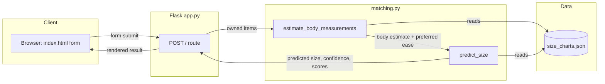

# Technical Architecture

Three components, cleanly separated.

- **Matching engine** — pure functions, no knowledge of Flask or HTTP. Takes fit data in, returns a prediction out. Swappable into a different interface (API, CLI) without touching the logic itself.
- **Flask layer** — only handles the web boundary: reads form fields, calls the engine, renders the result. Does not contain prediction logic.
- **Data layer** — flat JSON for v1. The dataset is small, read-heavy, and doesn't change mid-session — a database buys nothing at this scale. Documented upgrade path to SQLite once brand/category count grows.

**Deliberately absent in v1:** no persistence, no accounts, no session storage. Every prediction is stateless. Infrastructure gets built once there's a validated reason for returning users, not before.
