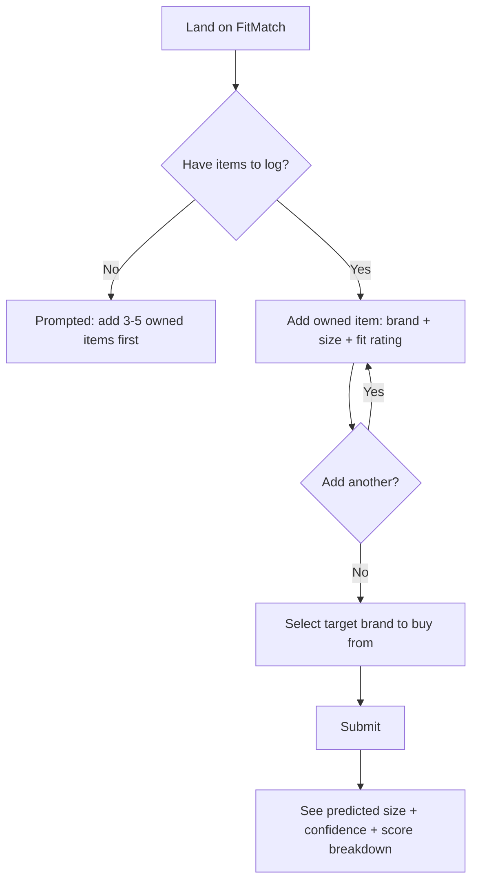

# User Flows

Complete interaction map: log fit history → predict → interpret result.

**Design principle:** an empty-state prediction is worse than no prediction. The flow makes it structurally impossible to predict without first logging fit history — not a warning message the user can dismiss, a hard requirement.

**Why the score breakdown is visible, not hidden:** a bare "your size is M" asks for blind trust. Showing the gap between the top prediction and the runner-up lets the user judge confidence themselves instead of taking the label's word for it — especially important given v1 runs on a heuristic, not a learned model.

**Why no account/login in v1:** anything that adds friction before the user reaches the core value — a prediction — works against adoption for an unvalidated concept. Prove the core loop first.

## Open usability questions

Deliberately left open for real testing rather than guessed at:

- Does "tight / true / loose" need per-region guidance, or is it self-explanatory?
- Is 3 owned items enough for users to trust a prediction, or do they want more before committing?
- Does a raw match-score number mean anything to a non-technical user, or does it need to become a visual bar?
