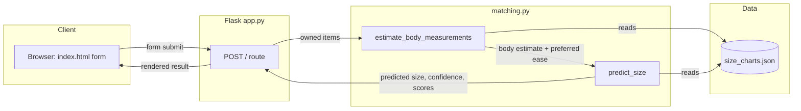

# Architecture

## High-Level Design

## Why this shape

**Separation of concerns:** `matching.py` has zero knowledge of Flask, HTTP, or HTML — it's pure functions that take data in and return data out. `app.py` only handles the web layer: reading form fields, calling the engine, rendering the template. This means the matching logic could be swapped into a different interface (a CLI, an API, a different frontend framework) without touching the prediction code at all — relevant if a v2 ever needs a proper API for a mobile client.

**Why JSON instead of a database for v1:** the data is small (5 brands, 1 category, ~5 sizes each), read-heavy, and doesn't change during a user session. A database adds setup and query complexity that buys nothing at this scale. The `PRD.md` roadmap notes SQLite as the planned upgrade once the dataset grows past what a flat file can reasonably hold (more brands, more categories, or per-user saved profiles).

**No persistence layer in v1 (deliberate):** there's no database storing user sessions or accounts. Every prediction is stateless — submit, get a result, done. This matches the MVP philosophy in `PRD.md`: prove the matching logic works before building infrastructure (auth, storage, user profiles) that only matters once there's a reason to have returning users.

## What would change at scale

Documented, not built, since this is intentionally out of MVP scope:
- **Data layer:** JSON → SQLite (or Postgres) once brand/category count grows, so lookups don't require loading the entire file into memory every request
- **Matching engine:** hand-tuned heuristic (`EASE_CM` constants) → a model trained on aggregate fit-outcome data across many users, replacing hard-coded ease assumptions with learned ones
- **Persistence:** add user accounts so fit history doesn't need re-entering every session — the highest-leverage addition for real-world usability, deliberately deferred until the core matching logic is validated
