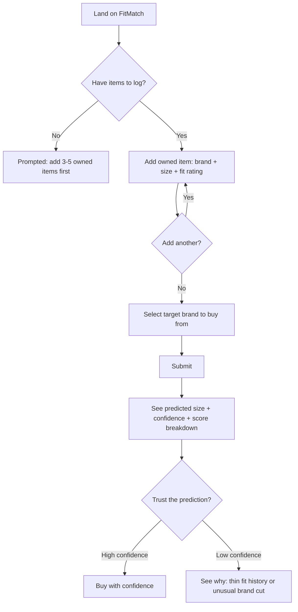

# Design

## User Flow



**Why this flow, not a simpler one:** the naive version would just ask "what's your size in Brand A?" and guess Brand B directly. Instead, the flow forces at least one round of "add an owned item" before prediction is even possible — because the entire value proposition depends on having fit history to reason from. An empty-state prediction would be worse than no prediction; the flow makes that structurally impossible rather than relying on a warning message.

## Low-Fi Wireframe (described, since this is a v1 functional prototype rather than a polished visual build)

```
┌─────────────────────────────────┐
│  FitMatch                        │
│  v1 — one category, 5 brands     │
├─────────────────────────────────┤
│  Items you own & how they fit    │
│  [Brand ▾] [Size ▾] [Fit ▾]      │
│  + Add another item              │
├─────────────────────────────────┤
│  Predict size for                │
│  [Target brand ▾]                │
│  [ Predict my size ]             │
├─────────────────────────────────┤
│  Predicted size: M               │
│  Confidence: High                │
│  ┌─────────────┬──────────────┐ │
│  │ Size         │ Match score  │ │
│  │ M            │ 0.59          │ │
│  │ L             │ 3.63          │ │
│  └─────────────┴──────────────┘ │
└─────────────────────────────────┘
```

**Design decisions:**
- **Score breakdown is visible, not hidden.** A pure "your size is M" answer asks for blind trust. Showing the gap between the top prediction and the runner-up lets the user judge confidence themselves, not just take the label's word for it.
- **Confidence is a first-class element, not a footnote.** Since v1 is a heuristic (not a learned model — see `PRD.md`), honestly signaling low-confidence cases matters more than hiding uncertainty behind a clean-looking single answer.
- **No account/login in v1.** Anything that adds friction before the user reaches the core value (a prediction) works against adoption for an unproven concept — validate the core loop before asking for signup commitment.

## Usability Notes / Next Iteration

Untested assumptions to check once real users try it:
- Do people understand "fit rating" (tight/true/loose) without further explanation, or does it need per-region guidance (e.g. "tight in the shoulders" vs. "tight overall")?
- Is 3 owned items enough to feel confident, or do users want to log more before trusting a prediction?
- Does the raw match-score number (e.g. "0.59") mean anything to a non-technical user, or should it be simplified to a visual bar?

These are exactly the kind of things usability testing (Step 14 of the original project brief) would surface — intentionally left as open questions rather than guessed at.
